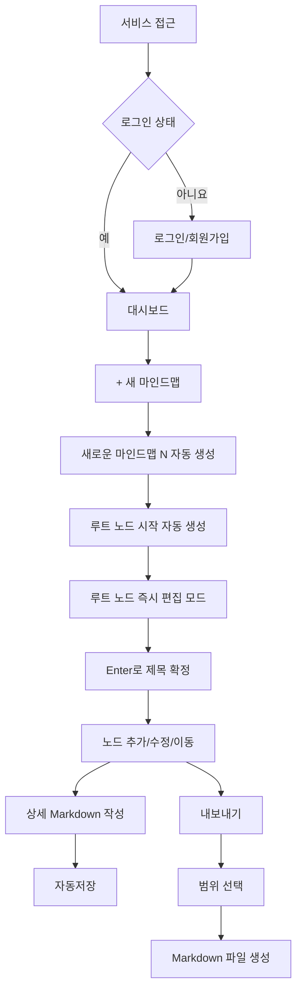

# 마인드맵 웹앱 MVP PRD + UI 구성안

> 문서 상태: 기획 확정안  
> 제품 단계: First Usable Version(MVP)  
> 핵심 목표: **사용자가 개인 지식을 마인드맵 구조로 만들고, 각 노드에 상세 문서를 기록하며, 필요한 범위를 Markdown으로 내보내 외부 도구에서도 활용할 수 있게 한다.**

---

## 1. 제품 개요

### 1.1 문제 정의

일반 메모 도구는 내용을 문서 단위로 관리하기 쉽지만, 개념 간 상위·하위 관계를 한눈에 파악하기 어렵다. 반대로 단순 마인드맵 도구는 관계를 시각화하기 좋지만 각 노드에 긴 설명을 축적하기에는 불편하다.

이 제품은 다음 두 가지를 결합한다.

- **마인드맵:** 지식과 생각의 구조를 시각적으로 탐색
- **노드 상세 문서:** 각 개념의 상세 내용을 Markdown으로 기록

추가로 작성한 지식 구조를 Markdown 파일로 내보내 외부 문서 도구나 AI 서비스에서도 활용할 수 있도록 한다.

### 1.2 목표 사용자

- 1차 사용자: 본인과 지인
- 사용 목적: 공부 내용, 아이디어, 프로젝트 기획 등 개인 지식 정리
- 협업보다 **개인별 데이터 분리와 편리한 작성 경험**을 우선한다.

### 1.3 MVP 성공 기준

사용자가 다음 흐름을 막힘없이 완료하면 첫 사용 가능한 버전으로 본다.

1. 서비스에 접속하고 로그인한다.
2. 대시보드에서 새 마인드맵을 생성한다.
3. 생성 직후 루트 노드의 제목을 바로 입력한다.
4. 루트 노드에서 자식 노드를 계속 추가한다.
5. 노드 위치와 제목을 수정한다.
6. 선택한 노드의 상세 문서를 Markdown으로 작성한다.
7. 페이지를 다시 열었을 때 마지막 저장 상태가 유지된다.
8. 전체 마인드맵 또는 선택한 노드 범위를 Markdown 파일로 내보낼 수 있다.

---

## 2. 확정 제품 정책

### 2.1 인증

- 비로그인 사용자는 서비스 기능에 접근할 수 없다.
- 비로그인 상태로 접근하면 **로그인 화면으로 이동**한다.
- 로그인 완료 후 대시보드에 진입한다.
- 개인 마인드맵 생성·조회·수정·삭제·내보내기는 모두 로그인 상태에서만 가능하다.
- 모든 마인드맵 데이터는 사용자별로 분리한다.

### 2.2 새 마인드맵 생성

대시보드의 `[+ 새 마인드맵]` 버튼을 누르면 별도의 제목 입력 모달 없이 즉시 마인드맵을 생성한다.

- 기본 마인드맵 제목: `새로운 마인드맵 N`
- `N`은 **사용자별 순번**을 기준으로 증가한다.
- 생성 후 즉시 마인드맵 편집기로 이동한다.
- 마인드맵 제목은 사용자가 이후 수정할 수 있다.
- 마인드맵 제목은 빈 값으로 저장할 수 없다.
- 신규 마인드맵의 번호 `N`은 **해당 사용자가 현재 보유한 마인드맵 중 가장 큰 번호 + 1**로 결정한다.
- 따라서 가장 큰 번호의 마인드맵이 삭제된 경우 해당 번호는 다시 사용될 수 있다.
- 중간 번호가 비어 있더라도 현재 최대 번호보다 작은 번호는 다시 채우지 않는다.

예시:
- 현재 `1, 2, 3` → `3` 삭제 → 현재 최대값 `2` → 신규 번호 `3`
- 현재 `1, 3` → 현재 최대값 `3` → 신규 번호 `4`

예시:

```text
사용자 A
├── 새로운 마인드맵 1
├── 새로운 마인드맵 2
└── 새로운 마인드맵 3

사용자 B
├── 새로운 마인드맵 1
└── 새로운 마인드맵 2
```

### 2.3 루트 노드

새 마인드맵 생성 시 루트 노드를 자동 생성한다.

- 기본 제목: `시작`
- 루트 노드는 삭제할 수 없다.
- 마인드맵 제목과 루트 노드 제목은 **서로 독립적으로 관리**한다.
- 마인드맵 생성 직후 루트 노드를 **편집 모드(Edit Mode)** 로 활성화한다.
- 입력 포커스를 자동으로 부여하고 텍스트 커서(caret)를 표시한다.
- 사용자는 별도 클릭 없이 즉시 `시작`을 원하는 개념명으로 변경할 수 있다.

### 2.4 제목 편집 규칙

마인드맵 제목과 모든 노드 제목에 다음 규칙을 적용한다.

- 빈 제목은 허용하지 않는다.
- 공백만 입력된 값도 빈 제목으로 처리한다.
- 기존 제목을 수정하다가 빈 값으로 확정하려 하면 저장하지 않는다.
- 유효한 제목이 입력된 경우에만 변경사항을 저장한다.

노드 편집 모드의 키보드 규칙은 다음과 같다.

| 입력 | 동작 |
|---|---|
| `Enter` | 입력 내용 확정 |
| `Esc` | 현재 편집 취소 |
| 노드 더블클릭 | 다시 편집 모드 진입 |

### 2.5 노드 상세 문서

- 노드를 선택하면 오른쪽 상세 패널에서 내용을 작성할 수 있다.
- 상세 내용은 Markdown을 지원한다.
- 상세 패널에서 전체 화면 편집 모드로 확장할 수 있다.
- 전체 화면 편집을 종료하면 기존 마인드맵 화면으로 돌아간다.
- 기존 캔버스 위치와 선택 노드 상태를 가능한 한 유지한다.

### 2.6 노드 배치

MVP의 기본 배치 방식은 **자유 배치**로 한다.

- 신규 노드는 부모 노드 주변의 기본 위치에 생성한다.
- 사용자는 노드를 자유롭게 드래그하여 위치를 변경할 수 있다.
- 드래그 종료 시 최종 위치를 저장한다.
- 부모-자식 관계 자체는 MVP에서 드래그로 변경하지 않는다.
- 자동 레이아웃은 2차 기능으로 검토한다.

### 2.7 목표 데이터 규모

- **마인드맵당 최대 1,000개 노드의 데이터를 관리할 수 있도록 설계한다.**
- 1,000개 노드를 한 화면에 동시에 렌더링해야 한다는 의미는 아니다.
- 실제 렌더링 범위는 접기·펼치기, 부분 로딩, viewport 기반 렌더링 등을 통해 제어한다.

---

## 3. MVP 범위

### 3.1 반드시 포함

| 영역 | 기능 | MVP 기준 |
|---|---|---|
| 계정 | 회원가입·로그인·로그아웃 | 사용자별 데이터 분리 |
| 인증 | 비로그인 접근 제한 | 비로그인 사용자는 로그인 화면으로 이동 |
| 대시보드 | 마인드맵 목록 | 제목, 최근 수정일, 노드 수 확인 |
| 대시보드 | 마인드맵 즉시 생성 | `새로운 마인드맵 N` 자동 생성 후 편집기로 이동 |
| 대시보드 | 이름 변경·삭제 | 빈 제목 금지, 삭제 전 확인 |
| 편집 | 루트 노드 자동 생성 | 기본값 `시작`, 생성 직후 편집 모드 |
| 편집 | 노드 생성·수정·삭제 | 루트 제외 일반 노드 CRUD |
| 편집 | 제목 유효성 검증 | 마인드맵/노드 모두 빈 제목 금지 |
| 편집 | 부모-자식 연결 | 한 일반 노드는 한 개의 부모를 가짐 |
| 편집 | 노드 자유 이동 | 캔버스 내 드래그 이동 및 위치 저장 |
| 탐색 | 확대·축소·화면 이동 | 큰 마인드맵 탐색 |
| 탐색 | 하위 트리 접기·펼치기 | 렌더링 범위 제어 |
| 상세 | 노드 상세 Markdown | 오른쪽 패널 작성, 전체 화면 확장 |
| 저장 | 자동저장 및 상태 표시 | `저장 중 → 저장 완료 → 저장 실패` |
| 복구 | 재접속 시 복원 | 마지막 서버 저장 상태 로드 |
| 내보내기 | Markdown 생성 | 전체 맵/현재 노드/현재 노드+하위 트리 내보내기 |

### 3.2 MVP 이후로 미루기

- 노드 부모 변경
- 자동 레이아웃
- 공동 편집
- 공유 링크 및 권한 초대
- 파일·이미지 첨부
- PNG/PDF 등 시각적 내보내기
- 버전 이력과 되돌리기
- 노드·본문 통합 검색
- 템플릿
- 모바일 전용 편집 UX
- AI 자동 가지 생성 및 요약
- 앱 내부 AI 채팅

> **범위 원칙:** 가지 생성 수에는 상품 제한을 두지 않는다. 성능 안정성을 위해 한 화면에서 동시에 렌더링하는 노드 수는 기술적으로 제어한다.

---

## 4. 핵심 사용자 흐름



### 4.1 대표 시나리오

1. 사용자가 서비스에 접근한다.
2. 비로그인 상태라면 로그인 화면으로 이동한다.
3. 로그인 후 대시보드에 진입한다.
4. `[+ 새 마인드맵]`을 누른다.
5. `새로운 마인드맵 N`이 자동 생성되고 편집기로 이동한다.
6. 중앙에 `시작` 루트 노드가 생성되며 즉시 편집 모드가 활성화된다.
7. 사용자가 개념명을 입력하고 `Enter`로 확정한다.
8. 노드의 `[+]`를 눌러 하위 개념을 계속 추가한다.
9. 노드를 드래그하여 자유롭게 배치한다.
10. 노드를 선택해 오른쪽 상세 패널에서 Markdown 내용을 작성한다.
11. 필요하면 상세 패널을 전체 화면으로 확장한다.
12. 변경사항은 자동 저장된다.
13. 필요한 범위를 Markdown으로 내보낸다.
14. 다음 접속 시 마지막 저장 상태에서 이어서 작성한다.

---

## 5. 주요 화면과 UI 구성

### 5.1 화면 목록

| ID | 화면 | 목적 | 핵심 구성 |
|---|---|---|---|
| S01 | 로그인·회원가입 | 사용자 인증 | 이메일, 비밀번호, 오류 안내, 로그인/가입 전환 |
| S02 | 대시보드 | 마인드맵 조회와 관리 | 새 마인드맵, 목록, 이름 변경, 내보내기, 삭제 |
| S03 | 마인드맵 편집기 | 구조 작성과 탐색 | 상단 바, 캔버스, 노드, 연결선, 탐색 컨트롤 |
| S04 | 노드 상세 패널 | 노드별 상세 문서 작성 | Markdown 편집, 전체 화면 확장, 저장 상태 |
| S05 | 삭제 확인 모달 | 실수 방지 | 삭제 대상, 하위 노드 영향, 취소, 삭제 |
| S06 | 내보내기 모달 | 지식 구조를 Markdown으로 추출 | 범위 선택, 포함 정보 안내, 파일 생성 |

### 5.2 S01. 로그인·회원가입

- 서비스의 비로그인 기본 진입 화면
- 이메일/비밀번호 입력
- 로그인/회원가입 전환
- 인증 오류 안내
- 로그인 성공 시 대시보드 이동

### 5.3 S02. 대시보드

#### 상단

- 서비스명/로고
- 사용자 메뉴
- 로그아웃

#### 본문

- 제목: `내 마인드맵`
- 주요 행동: `[+ 새 마인드맵]`
- 최근 수정된 마인드맵 목록

#### 마인드맵 항목

- 마인드맵 제목
- 최근 수정일
- 노드 수
- 클릭 시 편집기 진입
- 더보기 메뉴
  - 이름 변경
  - Markdown 내보내기
  - 삭제

#### 새 마인드맵 생성

`[+ 새 마인드맵]` 클릭 시:

```text
새로운 마인드맵 N 생성
        ↓
루트 노드 "시작" 생성
        ↓
편집기 진입
        ↓
루트 노드 Edit Mode + 자동 Focus
```

별도의 새 마인드맵 제목 입력 모달은 제공하지 않는다.

### 5.4 S03. 마인드맵 편집기

#### 상단 바

- 대시보드로 돌아가기
- 마인드맵 제목
  - 클릭하여 수정 가능
  - 빈 제목 저장 불가
- 저장 상태
- 더보기
  - 전체 마인드맵 내보내기

#### 중앙 캔버스

- 루트 노드
- 일반 노드
- 부모-자식 연결선
- 노드 자유 드래그
- 캔버스 이동
- 확대·축소
- 선택 노드 강조

#### 노드 기본 UI

```text
┌──────────────────┐
│      개념명       │
│            [상세] │
└──────────────────┘
        │
       [+]
```

#### 노드 액션

- `[+]`: 자식 노드 추가
- `[상세]`: 상세 패널 열기
- 더블클릭: 제목 편집 모드
- 더보기
  - 이름 변경
  - 하위 트리 접기/펼치기
  - 이 노드부터 내보내기
  - 삭제

### 5.5 S04. 노드 상세 패널

- 데스크톱 기준 오른쪽 슬라이드 패널
- 노드 제목
- Markdown 편집 영역
- Markdown 미리보기
- 전체 화면 확장
- 닫기
- 저장 상태
- 전체 화면 종료 시 기존 마인드맵 화면으로 복귀

### 5.6 S05. 삭제 확인 모달

일반 노드 삭제 시 하위 트리도 함께 삭제될 수 있으므로 사용자에게 영향을 명확히 알린다.

예시:

```text
'예금' 노드를 삭제하시겠습니까?

하위 개념 5개도 함께 삭제됩니다.

[취소] [삭제]
```

- 루트 노드는 삭제할 수 없다.

### 5.7 S06. 내보내기 모달

#### 진입 위치

- 대시보드: 전체 마인드맵 내보내기
- 편집기 상단: 전체 마인드맵 내보내기
- 노드 메뉴: 해당 노드 기준 내보내기

#### 지원 범위

- 전체 마인드맵
- 현재 노드만
- 현재 노드 + 모든 하위 개념

#### MVP 지원 형식

- Markdown(`.md`)

#### 포함 정보

- 마인드맵 제목
- 내보내기 선택 범위
- 개념 트리 구조
- 각 노드의 경로
- 노드 제목
- 노드 상세 Markdown

#### 제외 정보

- 화면 좌표
- 확대/축소 값
- 접기/펼치기 UI 상태
- 저장 상태 등 UI 전용 정보

---

## 6. 핵심 동작 규칙

### 6.1 제목 입력 및 편집

#### 공통

- 마인드맵 제목과 노드 제목은 빈 값으로 저장할 수 없다.
- 공백만 입력된 값도 허용하지 않는다.

#### 노드 Edit Mode

```text
Enter       → 입력 확정
Esc         → 편집 취소
더블클릭     → 편집 모드 진입
```

#### 최초 루트 노드

- 기본값은 `시작`
- 생성 직후 Edit Mode
- 자동 입력 Focus
- 사용자가 즉시 다른 개념명으로 수정 가능

### 6.2 노드 생성

- 선택한 노드의 `[+]`를 누르면 자식 노드를 생성한다.
- 신규 노드는 부모 주변의 기본 위치에 배치한다.
- 생성 후 제목을 입력할 수 있도록 편집 상태를 제공한다.
- 빈 제목 상태로 최종 생성하지 않는다.

### 6.3 노드 이동

- 드래그 중에는 프론트엔드의 화면 위치만 변경한다.
- 드래그가 종료된 시점에 최종 위치를 저장한다.
- 저장 요청 중에는 `저장 중…` 상태를 표시한다.
- 서버 저장 성공 후 `저장 완료` 상태로 변경한다.
- MVP에서는 노드 위치 이동으로 부모 관계가 바뀌지 않는다.

### 6.4 노드 상세 작성

- 오른쪽 상세 패널에서 Markdown을 작성한다.
- 전체 화면으로 확장할 수 있다.
- Markdown 내용은 자동 저장한다.

### 6.5 자동저장

- 텍스트 입력은 마지막 입력 후 일정 시간 추가 입력이 없을 때 저장한다.
- 노드 위치는 드래그 종료 시 저장한다.
- 저장 상태는 실제 서버 응답을 기준으로 표시한다.

상태:

- 변경 없음: 최소 표시
- 요청 중: `저장 중…`
- 성공: `저장 완료`
- 실패: `저장 실패 · 다시 시도`

저장 실패 시 작성 중인 로컬 상태를 즉시 버리지 않는다.

### 6.6 큰 마인드맵 처리

**목표: 마인드맵당 최대 1,000개 노드의 데이터를 관리할 수 있도록 설계한다.**

#### 사용자 체감 성능 목표

- 마인드맵 편집기 진입 시 사용자가 최초로 보게 되는 노드 영역은 **2초 이내 표시를 목표**로 한다.
- 네트워크 및 데이터 조회를 포함하더라도 **최대 5초 이내에는 사용 가능한 화면이 표시**되어야 한다.
- 1,000개 노드를 항상 한 화면에 동시에 렌더링해야 한다는 의미는 아니다.

#### 렌더링 원칙

- 데이터 구조상 깊이와 자식 수에 상품 제한을 두지 않는다.
- 최초 진입 시 현재 사용자에게 필요한 노드 범위를 우선 표시한다.
- 접힌 하위 트리는 펼칠 때 추가 로드하는 방식을 사용할 수 있다.
- 화면 밖 노드는 실제 PoC 결과에 따라 viewport 기반 렌더링을 적용한다.
- 접기/펼치기 상태를 저장할 수 있다.
- 화면 맞춤은 현재 로드된 노드를 기준으로 동작한다.

#### 캔버스 구현 방향

- 마인드맵 캔버스 라이브러리의 **1순위 후보는 React Flow(`@xyflow/react`)** 로 한다.
- 우선 자유 배치, 노드/연결선 렌더링, 확대·축소, 화면 이동, Custom Node, 접기·펼치기를 PoC한다.
- 1,000노드 테스트 결과를 기준으로 다음 최적화를 단계적으로 적용한다.
  - 하위 트리 접기/펼치기로 실제 표시 노드 수 제어
  - 화면 밖 요소의 viewport 기반 렌더링
  - Custom Node 불필요한 재렌더링 최소화
  - 노드/엣지 상태 구독 범위 최소화

> 처음부터 복잡한 Canvas/WebGL 구현을 진행하지 않고 React Flow 기반으로 사용성과 성능을 먼저 검증한 뒤 필요한 최적화만 추가한다.

### 6.7 Markdown 내보내기

내보내기는 마인드맵의 **지식 구조와 상세 내용을 다른 도구에서 활용할 수 있는 문서 형태로 변환하는 기능**으로 정의한다.

#### 지원 범위

- 전체 마인드맵
- 현재 노드만
- 현재 노드 + 모든 하위 개념

#### 기본 선택

- 마인드맵 단위 진입: 전체 마인드맵
- 노드 단위 진입: 현재 노드 + 모든 하위 개념

#### 형식

- UTF-8 Markdown(`.md`)

#### Markdown 구조 원칙

트리 깊이를 Markdown 헤딩 깊이에 직접 대응시키지 않는다.

```markdown
# 마인드맵: 금융 공부

## 선택 범위
금융 공부 > 예금

## 개념 구조
- 예금
  - 정기예금
  - 적금

## 개념 상세

### 예금
경로: 금융 공부 > 예금

[상세 Markdown]

### 정기예금
경로: 금융 공부 > 예금 > 정기예금

[상세 Markdown]
```

- 상세 내용이 비어 있는 노드도 구조 보존을 위해 제목과 경로를 포함한다.
- MVP에서는 다시 가져오기(import)를 지원하지 않는다.
- 특정 AI 서비스와의 직접 연동은 MVP에 포함하지 않는다.

---

## 7. 최소 데이터 구조

| 엔터티 | 주요 필드 | 설명 |
|---|---|---|
| User | id, email, password_hash, created_at | 사용자 계정 |
| Mindmap | id, user_id, title, created_at, updated_at | 사용자별 마인드맵 |
| Node | id, mindmap_id, parent_node_id, title, content_md, x, y, is_collapsed, created_at, updated_at | 노드 구조·내용·위치 |

### 관계 원칙

- `User 1 : N Mindmap`
- `Mindmap 1 : N Node`
- `Node 1 : N Node` 자기 참조
- 루트 노드: `parent_node_id = null`
- 모든 조회·수정·삭제 API는 로그인 사용자와 `mindmap.user_id`의 일치 여부를 검증한다.

---

## 8. 기능 요구사항과 완료 조건

| ID | 요구사항 | 완료 조건 |
|---|---|---|
| FR-01 | 사용자 인증 | 비로그인 상태에서는 개인 기능에 접근할 수 없고 로그인 화면으로 이동한다. |
| FR-02 | 사용자별 데이터 분리 | 다른 사용자의 마인드맵 URL에 접근해도 데이터가 노출되지 않는다. |
| FR-03 | 마인드맵 자동 생성 | `[+ 새 마인드맵]` 클릭 시 `새로운 마인드맵 N`이 생성되고 편집기로 이동한다. |
| FR-04 | 사용자별 순번 | `N`은 사용자가 현재 보유한 마인드맵의 최대 번호 + 1로 부여하며, 최댓값이 삭제된 경우 해당 번호를 다시 사용할 수 있다. |
| FR-05 | 루트 노드 생성 | 새 마인드맵마다 `시작` 루트 노드가 생성되고 즉시 편집 모드가 된다. |
| FR-06 | 제목 유효성 | 마인드맵과 노드 모두 빈 제목 또는 공백만 있는 제목을 저장할 수 없다. |
| FR-07 | 노드 편집 | `Enter` 확정, `Esc` 취소, 더블클릭 재편집 규칙이 동작한다. |
| FR-08 | 노드 추가 | 선택 노드에 자식 노드를 추가하고 새로고침 후에도 유지된다. |
| FR-09 | 노드 위치 이동 | 자유롭게 드래그할 수 있고 드래그 종료 후 위치가 저장된다. |
| FR-10 | 노드 삭제 | 일반 노드 삭제 시 하위 트리 영향이 안내되고, 루트 노드는 삭제할 수 없다. |
| FR-11 | 상세 문서 | Markdown 작성·미리보기·전체 화면 확장이 가능하고 자동 저장된다. |
| FR-12 | 접기·펼치기 | 하위 트리를 숨기고 다시 표시할 수 있다. |
| FR-13 | 자동저장 및 저장 상태 | 상세 Markdown은 2초 debounce로 저장하며, 제목 확정·노드 이동 등 명확한 액션은 완료 시 저장한다. 상태는 실제 서버 응답 기준으로 표시한다. |
| FR-14 | 오류 복구 | 저장 실패 후 재시도가 가능하고 작성 중 상태를 즉시 잃지 않는다. |
| FR-15 | Markdown 내보내기 | 전체 맵 또는 선택 범위를 `.md`로 생성하고 구조·경로·상세 내용을 보존한다. |
| FR-16 | 1,000노드 데이터 관리 | 마인드맵 하나에 최대 1,000개 노드 데이터를 관리하며, 최초 가시 영역은 2초 이내 표시를 목표로 하고 최대 5초 이내 사용 가능한 화면을 제공한다. |

---

## 9. 2차 기능 요구사항

### 9.1 부모 노드 변경

MVP에서는 지원하지 않으며 2차 기능으로 추가한다.

#### 제공 방식

1. **드래그 기반 부모 변경**
   - 노드를 다른 노드에 드롭하여 새로운 부모로 연결

2. **부모 선택 UI**
   - 노드 메뉴에서 `[부모 변경]` 선택
   - 폴더 선택과 유사한 트리 UI에서 새로운 부모 노드를 선택

예시:

```text
부모 변경

금융
├── 예금
│   ├── 정기예금
│   └── 적금
├── 대출
└── 카드
```

#### 필수 제약 조건

- 자기 자신을 부모로 선택할 수 없다.
- **자신의 하위 노드를 새로운 부모로 선택할 수 없다.**
- 부모 변경으로 순환 구조가 발생해서는 안 된다.
- 루트 노드의 부모는 변경할 수 없다.

### 9.2 자동 레이아웃

- 기본 자유 배치는 유지한다.
- 사용자가 원할 때 `[자동 정렬]`을 실행할 수 있도록 검토한다.
- 현재 부모-자식 관계를 기준으로 노드 위치를 재계산한다.
- 부모 변경 기능과 반드시 동시에 출시할 필요는 없으며 별도 하위 버전으로 분리할 수 있다.

---

## 10. 성능 검증 항목

마인드맵당 최대 1,000개 노드를 기준으로 다음 동작을 검증한다.

- 최초 마인드맵 진입
- 노드 렌더링
- 캔버스 이동
- 확대·축소
- 노드 선택
- 노드 드래그 이동
- 하위 트리 접기·펼치기
- 상세 패널 열기/닫기
- 자동저장
- 전체 마인드맵 Markdown 내보내기

검증 기준:

- 최초 가시 영역 표시 목표: **2초 이내**
- 사용 가능한 화면 표시 최대 허용: **5초 이내**
- 위 기준은 1,000노드 전체 동시 렌더링이 아니라 실제 초기 진입 시 필요한 화면 범위를 기준으로 측정한다.

---

## 11. 개발 우선순위

### Phase 1. 기본 사용자 흐름

1. 회원가입/로그인
2. 사용자별 데이터 분리
3. 대시보드
4. `새로운 마인드맵 N` 자동 생성
5. `시작` 루트 노드 + 즉시 Edit Mode

### Phase 2. 마인드맵 편집

1. 노드 생성
2. 노드 제목 편집 규칙
3. 노드 삭제
4. 연결선
5. 자유 배치
6. 확대·축소·캔버스 이동
7. 접기·펼치기

### Phase 3. 상세 문서와 저장

1. 오른쪽 상세 패널
2. Markdown 편집/미리보기
3. 전체 화면 확장
4. 자동저장
5. 저장 상태와 실패 복구

### Phase 4. 내보내기와 성능 검증

1. Markdown 변환 규칙
2. 전체 맵 내보내기
3. 단일 노드 내보내기
4. 선택 노드 + 하위 트리 내보내기
5. React Flow 기반 캔버스 PoC
6. 1,000노드 데이터 관리 및 2초 목표/5초 상한 성능 검증

---

## 12. 추후 검토 안건

### 12.1 앱 내부 AI 채팅

MVP에는 포함하지 않는다.

Markdown 내보내기를 통해 외부 AI 서비스에서 지식 구조를 활용하는 경험을 먼저 검증한 이후 별도 기능으로 검토한다.

검토 항목:

- 현재 노드 / 하위 트리 / 전체 마인드맵 중 AI Context 범위
- 사용자의 Context 직접 선택 여부
- 특정 AI Provider 또는 멀티 Provider 지원 여부
- API 비용과 인증 방식
- AI 대화 이력 저장 정책
- AI 응답을 노드나 상세 Markdown에 반영하는 방식

> **원칙:** MVP에서는 특정 AI 서비스에 종속되지 않는 Markdown 내보내기를 제공하고, 앱 내부 AI 채팅은 실제 사용 요구가 확인된 후 설계한다.

---

## 13. 현재 확정 상태

현재 핵심 사용자 흐름, MVP 범위 및 주요 구현 정책을 다음과 같이 확정한다.

- `새로운 마인드맵 N`: 현재 사용자가 보유한 최대 번호 + 1
- 최댓값 번호가 삭제된 경우 해당 번호 재사용 가능
- 중간에 비어 있는 번호는 별도로 찾아 재사용하지 않음
- 상세 Markdown 자동저장: 2초 debounce
- 제목 확정 및 노드 이동: 사용자 액션 완료 시 저장
- 데이터 규모: 마인드맵당 최대 1,000노드 관리
- 최초 가시 영역 표시: 2초 이내 목표
- 사용 가능한 화면 표시: 최대 5초 이내
- 마인드맵 캔버스: React Flow를 1순위 후보로 PoC
- 대규모 렌더링: 접기/펼치기를 우선 활용하고, 필요 시 viewport 기반 최적화를 단계적으로 적용

현재 PRD 기준으로 추가로 확정이 필요한 제품 정책은 없다.

> 구현 또는 PoC 과정에서 새로운 정책 결정이 필요한 항목이 발견되면 PRD를 임의로 확정하지 않고 별도 확인 후 반영한다.

---

## 한 줄 요약

**MVP는 로그인 후 즉시 생성되는 개인 마인드맵에서 `시작` 루트 노드를 기준으로 자유롭게 지식을 확장하고, Markdown 상세 기록·자동저장·선택 범위 내보내기까지 제공하는 버전이다.**
